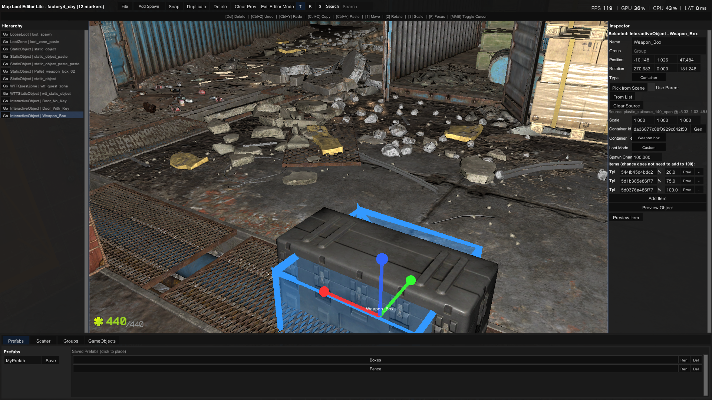
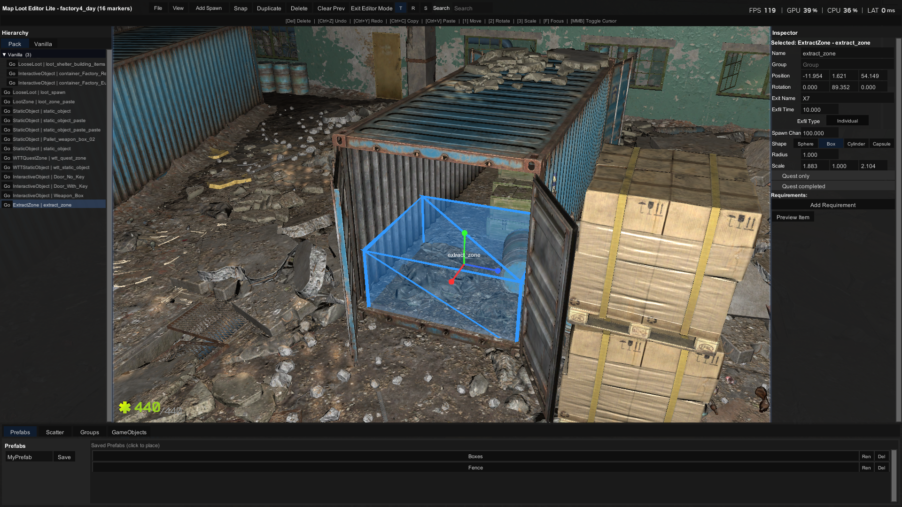

# Map Editor Lite - Custom Map Editor Framework

**Map Editor Lite** is a server-side framework for SPTarkov that lets anyone create and share custom map content - loot spawns, loot zones, static objects, interactive objects, bot spawn points, extract zones, and light zones - using an in-raid editor and simple JSON packs, no programming required.

## What It Does

- **In-raid editor**: press `F8` while in a raid to place markers, preview items, and build custom map packs.
- **Custom markers**: loot spawns, loot zones, static objects, interactive objects (doors & containers), bot spawn points, extract zones, and light zones.
- **Pack system**: export your map edits as shareable JSON packs.
- **Web tool**: import and tune exported packs, adjust spawn chances, mark quest/forced items, and finalize them for release.
- **Server injection**: the server mod reads pack JSON and injects the content into SPT raid loot tables, exfiltration points, bot zones, and lighting.
- **Forced spawns**: quest and guaranteed spawns are registered through **WTT-CommonLib**.
- **Modder friendly**: other mods can ship pack JSON files in their own `MapLoot/` folders; the server mod loads them automatically.

## Images




## Installation

1. Drag the `SPT` and `BepInEx` folders from the mod archive into your SPT installation directory.
2. Make sure **WTT-CommonLib** (`com.wtt.commonlib`) is installed as a server mod.
3. Start the server. Map Editor Lite loads automatically.

On first launch the client creates:

- `SPT/BepInEx/config/com.shaneeexd.mapeditorlite.cfg` — BepInEx configuration (editor toggle, hotkeys, etc.)
- `SPT/user/mods/MapEditorLite/` — client read/write data folder
  - `editor/`          # in-raid editor saves
  - `spawns/`          # built-in spawn directory
  - `imports/`         # files imported into the tool
  - `cache/`           # cached item data
  - `prefabs/`         # saved prefabs
  - `exports/`         # packs exported from the in-raid editor
  - `packs/`           # final user packs for the server to load

## Configuration

Edit `SPT/BepInEx/config/com.shaneeexd.mapeditorlite.cfg`:

```ini
[General]
EnableEditor = false
EnableDebugVisuals = false
```

- `EnableEditor` — set to `true` while developing. Default is `false`, so the F8 editor is disabled until you opt in.
- `EnableDebugVisuals` — show extra debug visuals in raid.

## Creating a Map Pack

1. Install the client plugin and server mod.
2. Set `EnableEditor = true` in the BepInEx config.
3. Enter a raid and press `F8` to open the editor.
4. Place markers for loot, zones, objects, bot spawns, extracts, or lights.
5. Enter a pack name and click **Export Pack** in the editor.
6. The exported pack is written to `SPT/user/mods/MapEditorLite/exports/`.
7. Open the **Map Editor Lite Tool**, import the pack, tune spawn chances, and mark any quest items as **Forced (Quest)**.
8. Move the final pack into `SPT/user/mods/MapEditorLite/packs/` (or your own mod's `MapLoot/` folder).

> **Tip**: Always test on a new developer profile (and clear temp cache) so you can verify spawns, loot, extracts, and lighting without affecting your main save.

## Publishing a Pack

The final pack is a JSON file that can be distributed as a standalone add-on.

When publishing:

1. **State the dependency**: Your add-on pack requires **Map Editor Lite v1.0.0** for SPT 4.0.13.
2. **Do not include** the Map Editor Lite DLL or other authors' packs in your zip.
3. **Test** by extracting and running the server before publishing.

Users install your pack by dragging the `SPT` folder (containing `SPT\user\mods\MapEditorLite\packs`) into their SPT install.

## Dependencies

- SPTarkov 4.0.13
- WTT-CommonLib (server mod)

## More Information

View my framework mods and user created add-ons for them [here.](https://serenity-workshop.netlify.app)

- Full documentation, JSON reference, and examples are in the [GitHub README](https://github.com/ShaneeexD/MapLootEditorLite/blob/main/README.md).

## License

MIT License
